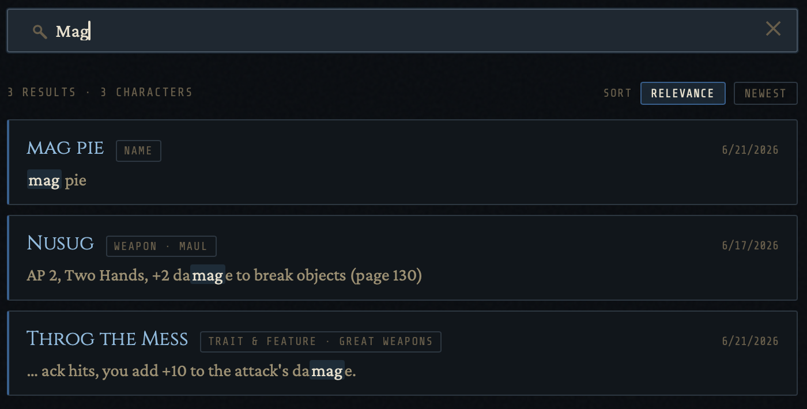

# Character Keeper


A self-hosted, system (TTRPG) agnostic, character sheet app for tabletop RPGs. You run it on your own server, you keep your own data (plain JSON files, no database), and you add new game systems by dropping in a folder instead of waiting for me to write code for them.

I built this for my own table and put it out there in case it's useful to anyone else who'd rather host their own thing than rent a SaaS character vault. It's aimed at personal and smallish group use, a handful of playersn and a few GMs.

Ships with sheets for **Savage Worlds Adventure Edition**, **Risus: The Anything RPG**, **Savage Pathfinder**, **Dungeons & Dragons 5e**, and **Advanced Dungeons & Dragons 2e**. The version number shows in the footer and at `/api/version`.

## A note up front: this was built with a lot of AI help

I should be honest about how this got made. I'm not a web developer, my
limited background is VB.NET and SQL, and I learn by copying something that works and tweaking it until I understand it. Pretty much all of Character Keeper was built in long back-and-forth sessions with Claude (Anthropic's AI), with me steering the design and asking "okay, but *why* does that work" until it stuck.

So if you read the code and find a comment that explains things a little too
thoroughly, or an architecture that's more carefully reasoned than a first time web project has any right to be, that's the collaboration showing. I'm putting this in the README because I think it's the honest thing to do, and because it might be encouraging to other hobbyists: you can build something real this way, as long as you stay in the driver's seat and actually learn the thing rather than just pasting whatever comes out.

Just know the design decisions are mine.

## What it does

- **Game systems are "bundles," not hard coded.** A bundle is just a folder with four files (layout, fields, styling, metadata). Drop it into the `bundles` directory, refresh, and the system shows up. Adding D&D 5e didn't require touching the app. New system = new folder, not a new release. I designed it this way to encurage community growth of the sheets. Im sure people with better ideas or more skills then me can come up with amazing sheets to share with others. 
    - **HTML-template sheets.** A bundle's layout is plain HTML wired to live data through `data-*` attributes. A single recursive renderer reads those attributes and binds them to state, so there's no custom React component per game.
- **Roles and visibility.** Every account is some mix of `admin` / `gm` /
  `player`. Players see their own characters. GMs see characters tagged to
  campaigns they run. Admins see the user list and settings.
- **Campaigns with join codes.** A GM makes a campaign and gets a short human code. Players opt in by tagging their own character to that code — nobody gets pulled into a campaign without their say-so. Once added, the GM of that campaign has read access to that character. all characters part of that campaign are grouped. 
- **Share links.** Generate a public read or read/write link for a single
  character, with an experation you pick. No login needed to open it. Editable links autosave just like the real sheet.
- **Global search.** Search across every character you can see — including their session notes, from one box. It respects the same visibility rules as the roster, so it never surfaces a sheet you aren't allowed to open. Searchable fields within the sheets are dicated by the Bundles author. 
- **Dice + a roll log.** Bundles can dicate visible die types in the dice tray otherwise the standard [d4, d6, d8, d10, d12, d20, d100] will apply.  Every throw gets logged per character (newest first, last 50 kept) so you've got a little history of how the dice have been treating you.
- **Session notes.** Date-stamped notes that live with the character (in their own file, so they don't fight with autosave). A bundle turns them on by declaring it in its schema.
- **File attachments.** Keep handouts, backstory PDFs, a loot spreadsheet, or a map alongside a character. Off by default; an admin flips it on. There's real security work behind this one.
- **Export.** Download a character as a file. If it's just the sheet you get raw JSON and a image of each tab and session notes, if any, are exported as markdown; if it has a portrait or attachments you get a tidy ZIP with everything, attachments restored to their real filenames.
- **Archive and life-status.** Characters can be `active`, `inactive`, `deceased`, `retired`, `shelved`, or `archived`. Any character that is not `active` drop into collapsible sections instead of cluttering the roster, you can change status or restore anytime.
- **Admin panel.** Create users, toggle roles, reset passwords, delete accounts, and set app-wide settings (default theme, whether external links are allowed in sheets, whether attachments are active).
- **Themes.** Six app themes — Tavern, Arcane, Verdant, Ember, Frost, and In The Grey. Each user picks their own; the admin sets the default for share pages and new accounts. A bundle's own sheet styling is separate from this.
- **Portraits.** Per-character image upload that gets cleaned up on delete and follows the character on rename.
- **Installable (PWA).** Manifest and icons, so it can live as an app on your
  phone or desktop.

#### Desktop


#### Mobile


#### Others





## Quick start

```bash
docker compose up -d
```

Then open `http://localhost:3210`.

On a brand-new install with no accounts yet, the app shows a one-time **setup
wizard** in the browser that creates your first admin. Once that first admin exists the wizard closes for good.

## Users

A fresh, accountless install shows the browser setup wizard at `/setup`. After the first admin exists, you've got three ways to make more accounts:

The in-app **Admin panel** is the easy one for day-to-day use.

From the command line at any time:

```bash
node adduser.js <username> <password> [--admin]
```

Or bootstrap a first admin from environment variables (handy for an unattended deploy, once the user exists it's never touched again):

```
INITIAL_ADMIN_USERNAME=<name>
INITIAL_ADMIN_PASSWORD=<password>
```

Passwords have to be at least 10 characters. I followed the modern advice
(NIST 800-63B) here: length matters more than forcing a symbol-and-a-number, so the app sets a floor and otherwise stays out of your way. Use a passphrase.

## Routes

| Path                 | Auth        | Purpose                                  |
|----------------------|-------------|------------------------------------------|
| `/setup`             | public¹     | First-run admin creation (one-time)      |
| `/login`             | public      | Login                                    |
| `/characters`        | required    | Roster                                   |
| `/characters/:id`    | required    | Character sheet                          |
| `/share/:token`      | public      | Public share view (view or edit)         |

¹ `/setup` only works while zero users exist; after that it redirects.

## Adding a new game system

Systems are **bundles**, and not coded into the app. A bundle is a folder with four files:

```
<your-bundle>/
  manifest.json   metadata (name, version, author, sheetId — a UUID v4)
  schema.json     field definitions + emptyCharacter template + empty-item templates
  sheet.html      the visual layout, with data-bind / data-list / data-type wiring
  theme.css       colors, fonts, layout (scoped under a wrapper class)
```

Drop the folder into the bundles directory, then either restart the container. On startup the backend scans for bundles, registers anything new in `sheets-registry.json`, and serves it to the frontend.

A few conventions the renderer leans on:

- Plain inputs use `data-bind` on its own. `data-type` is reserved for the special widgets: `tracker`, `readonly-name`, `portrait`, and `die`.
- The character name lives at `info.name`. The new-character default lives at the top level of the schema as `emptyCharacter`.
- Repeating lists use `data-list` / `data-item`, and new rows are filled from a schema key named by convention — list `skills` pulls from `emptySkill`, list `hindrances` from `emptyHindrance`. A template value of `@today` gets stamped with the current date.
- A bundle can keep extra data in its own sidecar file (session notes do this) by declaring `"sidecarPaths": ["sessions"]` in its schema, so big optional data doesn't bloat the main character file or race autosave.
- Bundles are self-contained. Ship your fonts, backgrounds, and logos inside the bundle folder and reference them through `/api/sheets/:sheetId/assets/...` —don't reach out to the web.
- Scope your theme CSS under a wrapper class so it can't leak out into the app's own chrome. `risus-core` is the cleanest reference for getting that right.

The scanner only ever **adds** bundles. It never edits or removes an existing
registry entry, and if two bundles claim the same `sheetId`, the oldest
registration wins. Bundle file contents (schema, layout, theme, assets) are read live, so editing those just takes a reload; changing a *registered* bundle's manifest metadata needs an admin refresh to re-register.

The five shipped bundles (`swade-core`, `risus-core`, `savage-pathfinder`,
`dnd5e`, `adnd2e`) are working references to copy from.

## Data & volumes

The container uses two mounts (see `docker-compose.yml`):

```yaml
volumes:
  - ./data:/data         # persistent app data
  - ./bundles:/bundles   # game-system bundles (BUNDLES_DIR=/bundles)
```

```
data/
  users.json            accounts and hashed passwords
  campaigns.json        shared campaign list
  settings.json         app settings (default theme, link policy, attachments)
  sheets-registry.json  generated bundle registry
  characters/<user>/    one JSON per character, plus its portrait, session notes,
                        roll log, and any attachments — all named after the character id

bundles/
  <bundle>/             installed game-system bundles
```

`BUNDLES_DIR` controls where bundles live; if it's unset it falls back to
`data/sheets/`. The built-in bundles get seeded into the bundles directory on
first run, and existing folders are never overwritten, so your edits and your own drop-ins stick around across updates.

Character files are plain JSON. Easy to backup and copy. That portability is on purpose, and it's why there's no database.

## Production environment

When you run this behind a reverse proxy with HTTPS:

- `NODE_ENV=production`
- `SESSION_SECRET=<long random string>`: the server **refuses to start in
  production** without it. Generate one with:
  ```bash
  node -e "console.log(require('crypto').randomBytes(32).toString('hex'))"
  ```
- `CORS_ORIGINS`: leave this **unset** in production. The backend serves the
  frontend from the same origin, so there's no CORS to configure.

`trust proxy` is on so secure cookies and real client IPs work behind a proxy
that terminates TLS.

## Development

Run the backend and frontend in two terminals:

```bash
# Backend (defaults to port 3001)
npm install && npm start

# Frontend dev server (port 3000)
cd frontend && npm install && npm start
```

There's no CRA proxy. In dev the frontend talks to the backend through two env vars:

- Frontend: `REACT_APP_API_URL=http://localhost:3001`
- Backend: `CORS_ORIGINS=http://localhost:3000` (so the dev server can send
  session cookies)

For a production-style run, build the frontend first, then bring up the container:

```bash
cd frontend && npm run build
docker compose up -d --build
```

## Security

I'm not a security professional, so I leaned hard on AI guidance here and tried to do the important things properly. What's in place:

- Helmet security headers (X-Powered-By off, HSTS in production)
- Login rate limiting
- Crypto-random share and join tokens
- Path-traversal guards on every route that takes an id, so a crafted id can't escape the user's own folder
- An image only guard on the portrait mount (closes a JSON leak vector)
- Session cookie hardening (`httpOnly`, `sameSite`, `secure` in production)
- `SESSION_SECRET` required to boot in production
- A minimum password policy (10+ chars) shared across setup, admin-create, and password reset
- Field-ownership rules in autosave: a stale open sheet can't clobber campaign membership, shares, status, or the attachment list — those are read from disk and owned by their own endpoints
- CSRF synchronizer token (env-gated via `CSRF_ENFORCE`; recommended on)
- Bundle HTML are sandboxed via an attribute allowlist, DOMPurify, CSS scoping, and off-origin resource blocking. Community bundles shared on Discord, Reddit, or GitHub are safer to install than before, but treat them with the same judgment you'd apply to any third-party code — review what you're installing, especially on a multi-user instance.

The **attachments** feature got the most careful treatment, because letting users upload arbitrary files is worrisome. The approach is "store inert, serve guarded": an allowlist of extensions (not a denylist), a magic-byte sniff so a renamed `evil.exe` → `backstory.pdf` gets caught, server-generated filenames so your original name never touches the filesystem, pinned content types with `nosniff`, and a forced download for anything the browser might try to execute. Active-content types like SVG are deliberately left off the list. There are per-file (25 MB), per-character (50 files), and total (250 MB) caps.

**Content-Security-Policy** is enforced when CSP_ENFORCE=true (report-only by default — watch the console, then flip). See .env.example for all available security toggles.

See [SECURITY.md](SECURITY.md) for the reporting process and security model.

## Security & Disclaimer

Character Keeper is **free software, provided "as is", without warranty of any kind.** See [LICENSE](LICENSE) (GNU AGPL v3) for the full terms, including the warranty disclaimer (§15) and limitation of liability (§16). The authors and contributors are **not liable** for any damages, data loss, or security incidents arising from its use, misuse, or deployment.

It is designed to be **self-hosted for a trusted group**, not run as a public service for untrusted or anonymous users. You are responsible for securing your own deployment. In particular:

- Set a strong, unique `SESSION_SECRET` (`openssl rand -hex 32`) and never commit it. The server refuses to start in production without one.
- Run behind HTTPS (e.g. a reverse proxy) for any networked deployment.
- Set `CSRF_ENFORCE=true` and review the other toggles in [`.env.example`](.env.example).

For configuration options, see [`.env.example`](.env.example). To report a
security issue, see [SECURITY.md](SECURITY.md) — please report privately, not via a public issue.

## Roadmap

Roughly in order, dependency-permitting:

- **Bundle HTML Sandboxing** — gated on the bundle-sanitization work above.
- **Security Audit** - confirm every mutating route rejects unauthenticated and cross-user requests, and lock that down with automated tests so it can't quietly regress.
- **More Bundles** — candidates I'd like to do next include D&D 3e, D&D 5e 2024, and Star Wars Saga Edition.
- **Mobile layout polish** — single-column, collapsible sections on small screens.
- **Standalone HTML export** — bake a character plus its template into one portable file you can open without the app. 
- **Attachment txt/md Editing** - allow inbrowser editting of .md and .txt attachments. 
- **Character Ownership transfers** - Allow a user to transfer a character then own to another User/Admin. 
- **Admin login-history log** - Build in a viewable log for the admin to monitor session logins from users and shares.
- **User Die Size Setting Override** - Allow users to set thier own die size on a scale. 
- **Add d2/coin-flip** - Dice-Box currently doesnt have a d2 or Coin render so I am attempting on figuring out how to add one. 

## Why it's built the way it is

- **JSON-per-character is intentional.** Easy to back up, portable, git-friendly, and there are no database migrations to dread. The files are the product.
- **The schema is the source of truth for fields.** Game-specific knowledge lives in bundles, never in the renderer. A new system should never mean new app code.
- **`window.location.origin` for public URLs.** Zero config; works the same locally and behind a reverse proxy.
- **Build one thing at a time, all the way through.** I'd rather finish a feature properly than have five half-built ones. The codebase tries to reflect that.

## License

Intended to be released as free and open source software under the **GNU AGPL
v3**. (If you're self-hosting a modified copy and exposing it to others over a network, the AGPL is the license that asks you to share those changes back, which fits the spirit of how this was made.)

## Credits

Built by me, CDubs00, with extensive help from Claude across many long sessions design discussion, code, debugging, and a running commentary that doubled as a webdev crash course. The bundles, the hosting, the stubbornness, and the bad decisions are mine; a great deal of the explaining was the AI's.

Game system content (SWADE, Savage Pathfinder, D&D, AD&D, Risus, etc.) belongs to their respective publishers. The bundles here are character-sheet layouts for personal use, not redistributions of anyone's rules.
